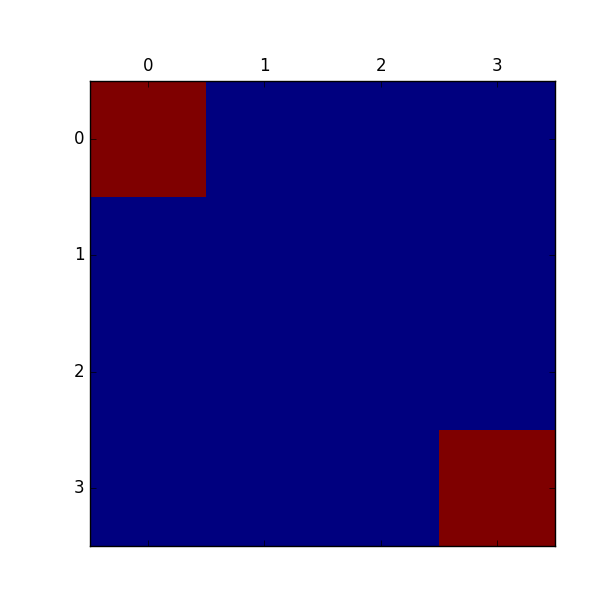
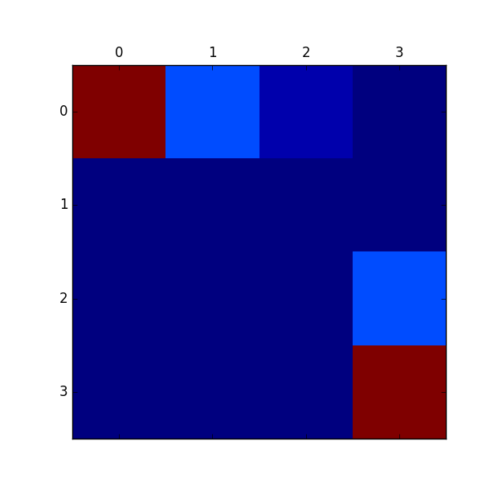
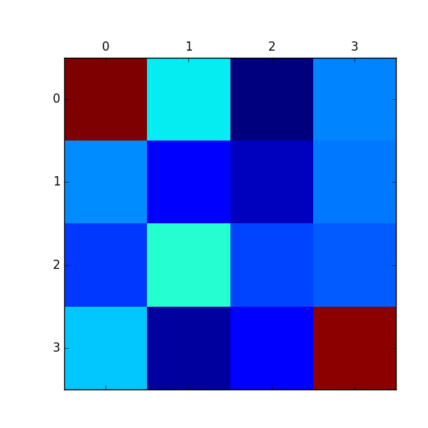
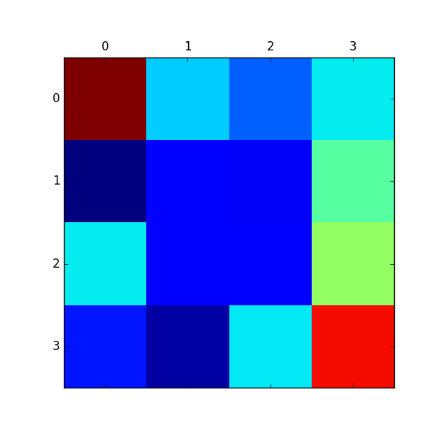

# Inverse Reinforcement Learning

## Implemented Algorithms

* LP IRL
* Maximum Entropy IRL
* Maximum Entropy Deep IRL

## Reward Map

* Ground Truth

* LP

* Maximum Entropy IRL

* Maximum Entropy Deep IRL

## Requirements

* OpenAI gym
* numpy
* scipy
* chainer